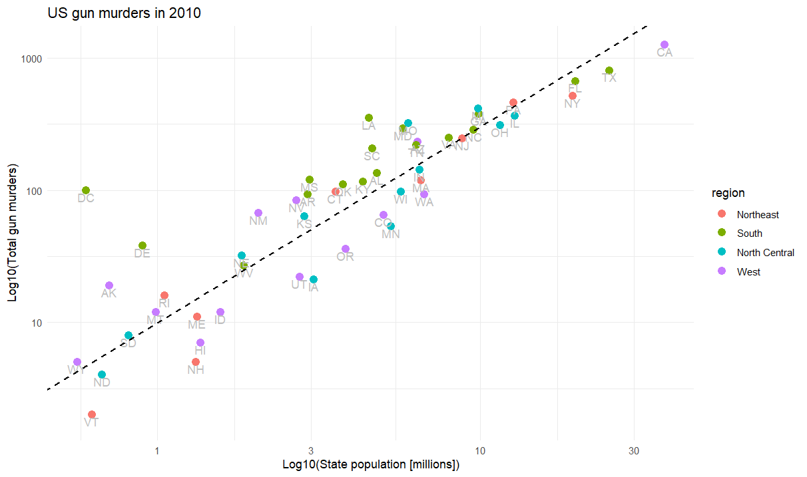
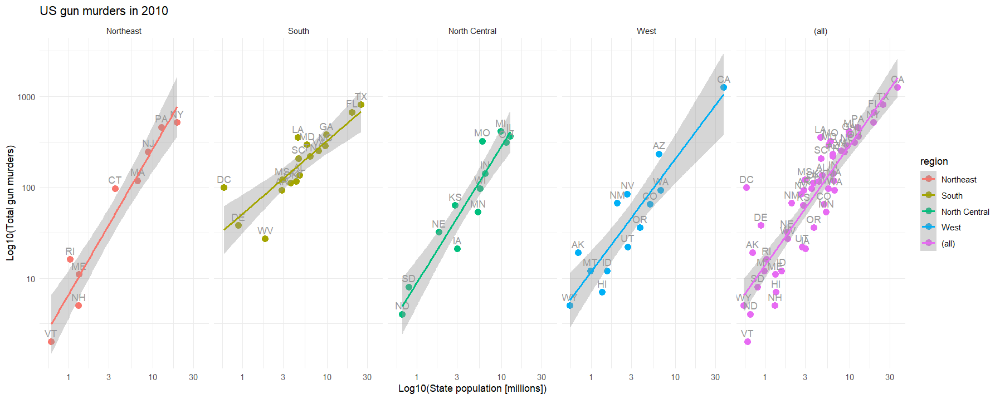
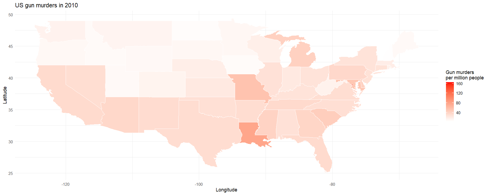

# Visualised_states
R scripts for visualising data about gun murder data from the USA, inspiration from Introduction to Data Science by Rafael Irizarry

# Combined gun murders graph

# Gun murders graph faceted by region

# Gun murders chloropleth map

